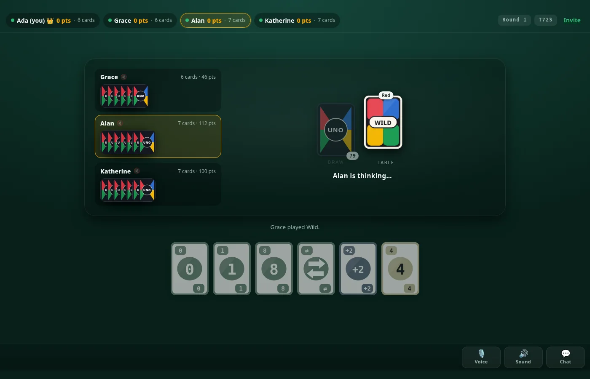
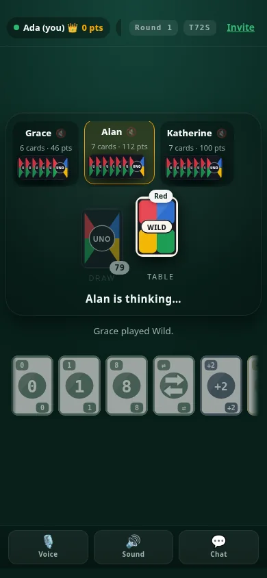
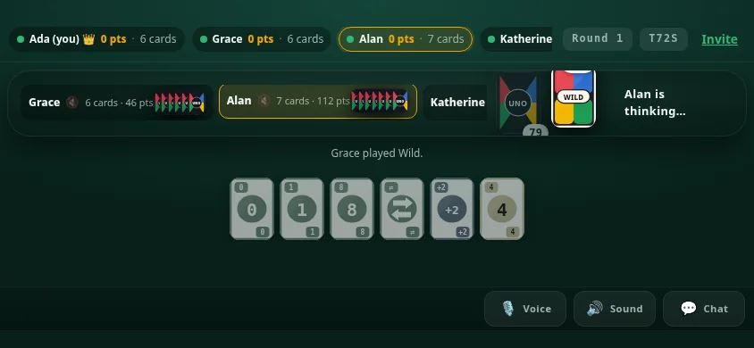
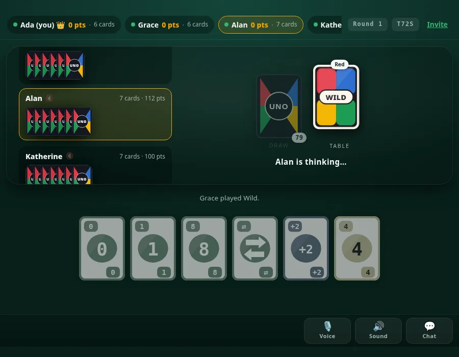

<div align="center">

# 🃏 UNO

### Play your friends online. One link, up to six players, endless rounds.

No accounts. No build step. One Node process and a dependency you already have.

[](https://github.com/xBlackZeus/uno/actions)
[](https://nodejs.org)
[](LICENSE)
[](package.json)

<br>



<br>

`npm install && npm start` → [http://localhost:3000](http://localhost:3000)

</div>

---

## What it does

<table>
<tr><td width="50%" valign="top">

**Play**
- Full 108-card rules — skip, reverse, draw two, wild, wild draw four
- Challengeable wild draw fours, with the server remembering whether you lied
- 2–6 players, endless rounds, cumulative scoring to 500
- UNO calling, catching a late UNO, and the automatic two-card penalty

**Talk**
- Peer-to-peer WebRTC voice, opt-in, ~24 kbps per player
- Text chat plus 24 stickers
- Chat costs no extra data: it never carries the board

</td><td width="50%" valign="top">

**Works**
- Desktop, tablet, phone portrait and phone landscape
- Keyboard playable, screen-reader announced, `prefers-reduced-motion` honoured
- Reconnect keeps your seat and your hand for 30 minutes
- No database, no accounts, no cookies

**Runs on**
- A laptop, a Raspberry Pi, a free Render tier
- One process: it serves the client *and* the WebSocket

</td></tr>
</table>

<br>

## Screens

<table>
<tr>
<td width="33%" align="center"><br><sub>Portrait — the hand scrolls, the dock is thumb-height</sub></td>
<td width="33%" align="center"><br><sub>Landscape — one row, nothing below the fold</sub></td>
<td width="33%" align="center"><br><sub>Tablet</sub></td>
</tr>
</table>

<br>

## Running it

```bash
npm install
npm start          # http://localhost:3000  — serves the client and the game
npm test           # 88 tests: rules engine, wire format, real WebSocket clients
```

Friends on your wifi can join at `http://<your-ip>:3000` — the server binds
`0.0.0.0` by default. Override with `PORT` and `HOST`.

### Voice chat over a LAN — read this one

**Voice needs a secure context, and that is the whole story.** Browsers only
expose `navigator.mediaDevices` on an `https://` origin, or on `localhost`. Open
the game from a phone at `http://192.168.1.10:3000` and `mediaDevices` is not
merely unusable, it is **absent** — there is no microphone to ask for. The game
plays perfectly; only voice is out of reach.

This is not a phone problem and not a browser bug. It is a transport problem,
and it is worth being precise about because the symptom looks exactly like a
browser limitation:

| Origin | `isSecureContext` | `navigator.mediaDevices` | Voice |
| --- | --- | --- | --- |
| `http://localhost:3000` | `true` | present | works |
| `http://192.168.1.10:3000` | `false` | **undefined** | impossible |
| `https://192.168.1.10:3000` | `true` | present | works |

Rather than report "this browser cannot do voice chat", the client checks
`isSecureContext` separately from the API check and names the actual cause with
the fix (see `VOICE_HELP` in `public/app.js`).

To make voice work from another device, serve over TLS. The server switches to
HTTPS on its own when it finds a certificate and key, and the WebSocket upgrade
rides along as `wss://`:

```bash
mkdir -p certs
mkcert -install                       # install the local CA once
mkcert -cert-file certs/cert.pem -key-file certs/key.pem \
       localhost 127.0.0.1 192.168.1.10 # every address players will use
npm start                              # now https://
```

Then install the mkcert CA on each phone — Chrome: *Settings → Security →
Encryption & credentials → Install a certificate → CA certificate*. iOS:
install the profile, then enable it under *Settings → General → About →
Certificate Trust Settings* (mandatory there, or Safari refuses the page).

**TURN, if direct connections don't work.** STUN is enough on most home
networks; two players behind symmetric NAT will need a relay:

```bash
TURN_URL=turn:your-host:3478 TURN_USERNAME=… TURN_CREDENTIAL=… npm start
```

Credentials are read from the environment and handed to clients at join time, so
they never enter the JavaScript bundle.

<br>

## The rules

Standard 108-card deck: four colours, one `0` and two of each `1`–`9` per colour,
two each of skip / reverse / draw-two, plus four wilds and four wild draw-fours.

- Match the colour or the number; wilds and wild draw-fours always playable.
- **Skip** jumps a seat. **Reverse** turns the direction — and, with two players,
  hands the turn straight back.
- **Draw Two** costs the next player two cards and skips them.
- **Wild** — you pick the colour. **Wild Draw Four** — you pick the colour and
  the next player draws four and is skipped.
- **Challenge** on a wild draw four. The server remembers whether you were
  actually holding the colour you called. If you were, the challenger draws six
  and you get the turn back. If you were not, the challenger draws four.
- **Draw** and you may only play the card you just drew; if it does not fit, the
  turn passes.
- **UNO** — call it when you are down to one card. Say it late and you draw two
  automatically. Your opponent can also catch you and make you draw two. Both
  come from the same rule, so nobody escapes it.

<br>

## How it is put together

| File | What it does |
|---|---|
| `server/game.js` | The rules. Pure functions, no I/O. The only place a legal move is decided. |
| `server/rooms.js` | Who is at which table, and the game behind it. |
| `server/index.js` | HTTP or HTTPS (serves the client) + WebSocket (`/ws`). |
| `public/cards.js` | Card artwork, drawn as inline SVG. |
| `public/stickers.js` | The built-in sticker set (glyphs, not images). |
| `public/voice.js` | WebRTC mesh, capability diagnostics, reconnection. |
| `public/motion.js` | Every animation, one timing table, one reduced-motion gate. |
| `public/sfx.js` | Sound effects, synthesised — no audio files. |
| `public/particles.js` | Confetti and bursts on one canvas. |
| `public/app.js` | The client. Sends intents, renders whatever the server says is true. |

**The server owns the game.** A browser only ever sends intents (`play`, `draw`,
`accept`, `challenge`, `uno`, `catch`, `nextRound`). It never decides what is
legal, so two clients cannot drift apart or cheat. The server also decides which
of your cards are playable and names them in the view, so the UI cannot disagree
with the rules.

**Hands are never sent to the wrong player.** `viewFor()` gives you your own cards
and only a *count* for your opponent's. Tests assert that no opponent card id,
and no draw-pile card id, ever appears in the payload you receive.

**No framework.** Plain DOM, deliberately: the whole UI is a re-render of one
small view object, and a virtual DOM would add a build step and a bundle to
solve a problem this app does not have.

**Animations react to differences between two states, not to guesses.** The
server re-sends the full view on every change, so the client keeps a snapshot
and compares. A card flies to the table because `top.id` actually changed, and a
UNO burst fires because a player left `unoOpen`. That is why effects cannot fire
spuriously, and why they still fire when the change came from another player.

**One timing table, mirrored in two places.** `UNOMotion.duration` and the
`--t-*` custom properties in `style.css` hold the same values, so a CSS
transition and a JS animation of the same effect cannot drift apart.

**Only `transform` and `opacity` are animated** — compositor-only properties that
never trigger layout, which is what keeps a mid-range Android from dropping
frames mid-turn. Confetti is a single `<canvas>` with one `requestAnimationFrame`
loop that stops when the particles are gone; a burst of 150 `<div>`s would cost
150 paint objects at the exact moment the player is watching.

**Selection is real state, not a hover.** `.is-selected` is applied by the client
and survives a re-render, because otherwise every state push would drop the
highlight the player is in the middle of acting on. All hover styling sits inside
`@media (hover: hover)` — on a touchscreen `:hover` sticks after a tap, which
makes a card look selected when it is not.

**Reduced motion removes movement, never feedback.** A card still appears, a turn
still highlights and a toast still shows; they simply arrive at once, and
selection keeps its ring rather than its lift.

<br>

## More than two players

Pick 2–6 when you create the game. The deal starts when the table fills, or
sooner if the host presses **Start now** — handy when you would rather not wait
for a sixth person. The host can resize the table any time before the deal, and
the crown in the scoreboard shows who that is.

Everything else is unchanged: hands stay hidden, the server still decides every
move, and the turn passes properly around a table of any size. If someone drops
mid-turn, the turn is handed on rather than stalling on a ghost seat, and their
seat is kept for 30 minutes.

### Why chat is not a picture

**Chat** is its own small message type, and it deliberately does *not* carry the
board. Text is the most frequent traffic in the app, and bundling the game state
with every sentence would make "ok" cost a full state push.

**Stickers** are a built-in set of glyphs, not uploaded images. An image sticker
is tens of kilobytes that every player downloads; a sticker here is a few bytes of
a short id, so a table can spam them all day for almost nothing. Uploaded images
would also need somewhere to live — there is no storage in this project. Messages
are capped at 400 characters and the last 40 lines are kept.

<br>

## Configuration

All optional. With none of them set the server runs plain HTTP on port 3000 and
everything except voice works.

| Variable | Default | What it does |
|---|---|---|
| `PORT` | `3000` | Port to listen on. |
| `HOST` | `0.0.0.0` | Interface to bind. All interfaces by default. |
| `TLS` | — | Set to `off` to force plain HTTP even when a certificate exists. |
| `TLS_CERT` | `./certs/cert.pem` | Certificate. Its presence switches the server to HTTPS. |
| `TLS_KEY` | `./certs/key.pem` | Private key. Both are required to enable TLS. |
| `TURN_URL` | — | TURN relay for voice, e.g. `turn:host:3478`. |
| `TURN_USERNAME` | — | TURN username. |
| `TURN_CREDENTIAL` | — | TURN credential. |

Nothing secret is committed: TLS material is gitignored and TURN credentials are
handed to clients at runtime.

<br>

## Reliability

- **Refreshing or losing connection keeps your seat** for 30 minutes. Your seat
  token lives in `localStorage`, so reopening the invite link walks you straight
  back to the table with your hand intact.
- Reopening the same game in a second tab replaces the first connection rather
  than duplicating your seat.
- Abandoned rooms are swept up after six hours.
- **A port already in use is a sentence, not a stack trace.** Starting a second
  copy tells you how to find and stop the first one, or how to use another port.
- Audio preferences survive a reload, and sound only begins after a real user
  gesture, so nothing ever trips the autoplay policy.

### The honest part about data

Voice is the only thing here that costs real bandwidth, and it costs far more
than everything else combined: roughly **24 kbps per player** while talking, on
top of a few hundred bytes of signalling once per peer. So:

- Voice is **opt-in and off by default**, and the UI says what it costs before
  you allow the microphone.
- The dock shows whether your mic is live or muted. A player's ring pulses while
  their audio level is genuinely above the noise floor — measured from the
  stream, not assumed from "they have a mic on".
- Muting disables the audio track without tearing down the connection, so
  un-muting is instant and costs nothing to set up again. The separate **End**
  button is what releases the microphone completely.
- Voice reconnects on its own with a capped backoff if a phone sleeps, changes
  Wi-Fi or loses signal.
- If nobody turns it on, the app uses no more data than before voice existed.

Everything else is deliberately cheap: `permessage-deflate` is on, chat and
stickers never trigger a board broadcast, presence changes send only the lobby,
and animations are entirely local — they cost frame rate, not data.

<br>

## Deploying

GitHub Pages serves static files only, so it cannot host a live game. The two
halves are deployed separately, both from this one repository.

**1. Push to GitHub**, then turn Pages on: *Settings → Pages → Source: GitHub
Actions*. The workflow in `.github/workflows/deploy.yml` runs the test suite and
publishes `public/`.

**2. Host the server.** The free tier of Render reads `render.yaml` directly:
*New → Blueprint → your repository*. Any host that runs `npm start` and exposes
`healthCheckPath: /healthz` works the same way. Note that a free service sleeps
when idle, so the first game after a quiet spell waits for it to wake.

**3. Connect them.** Add a repository secret `UNO_SERVER_URL` set to your server
address. The workflow writes it into `public/config.js` at build time.

Invite links carry the code as `?room=ABCD` rather than as a path, because a query
string works on any static host — no server rewrites, and relative asset URLs keep
resolving. `/room/ABCD` still works if someone types it.

To skip Pages entirely, just open the Node server's own URL: it serves the client
too, so there is one link to share and nothing to configure.

<br>

## Testing

`npm test` runs 88 tests with no framework — `node --test`.

- The rules engine is exercised directly: card conservation, legal-move
  enforcement, every wild-draw-four outcome, scoring, endless rounds, and a
  randomised full game played to completion that asserts no turn ever sticks.
- The wire format is tested for leakage: no opponent card id and no draw-pile
  card id may appear in a player's payload.
- `test/e2e.test.js` drives real WebSocket clients against a real server.

The UI was developed against a Playwright sweep that drives two real players
through every breakpoint listed above in both orientations, and fails on any
console error, page exception, clipped element, touch target under 40px, or
component pushed below the fold.

<br>

## License

MIT — see [LICENSE](LICENSE).